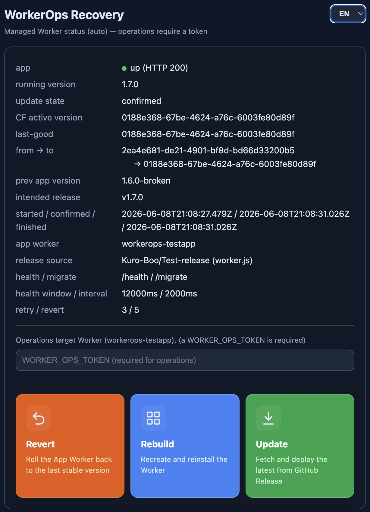

<div align="center">

# WorkerOps

**Cloudflare Worker を安全・可逆に自己更新させる、汎用ガーディアン Worker**

[](LICENSE.txt)
[](https://workers.cloudflare.com/)
[](#)

任意の Cloudflare Worker の前段に置く小さな番人。更新の指示出し・デプロイ後のヘルス検証・失敗時の自動 revert・復旧 UI を担い、ユーザーに Cloudflare を直接操作させない。



</div>

---

## Why（なぜ必要か）

Cloudflare Workers では、**実行中の Worker が自分自身を安全にロールバックできません**。新バージョンがバグると、ロールバックを実行する主体（その Worker 自身）ごと壊れるからです。

WorkerOps は「常に生きている小さな番人」として app Worker の前段に立ち、更新・ヘルス検証・自動 revert・復旧をすべて引き受けます。ユーザーは Cloudflare ダッシュボードを直接触る必要がありません。

## What it does（できること）

- **転送 / Reverse-proxy**: 自分専用パス（`OPS_PATH`）以外を app Worker へ Service Binding で転送。app 異常時はメンテ画面＋復旧 UI を表示。
- **更新 / Update**: リリース元から新しい `worker.js` を取得し、Cloudflare API でデプロイ。
- **検証 → 自動 revert**: デプロイ後にヘルス検証し、不健全なら直前の安定版（last-good）へ自動で戻す。
- **復旧 UI / Recovery UI**: 更新・revert・再導入をボタンで実行。**Windows のリカバリ画面のように必要最低限**の自己完結 1 画面（外部 CSS/JS 非依存・app 停止中も操作可）。
- **耐久ステート**: 更新の各段階を自前 KV に journaling。途中で落ちても Watchdog が後始末。

## Design principles（設計原則）

| 原則 | 内容 |
|---|---|
| Small & stable | WorkerOps 自身はめったに更新しない。コードを最小に保つ。 |
| Project-agnostic | app のデータモデルに依存しない。設定（env）と「Contract」だけで動く。 |
| DB-less | 状態は汎用 KV（`WORKEROPS_STATE`）。マイグレーションは app に委譲。 |
| Revert-first | 更新直後の不調は「直前の安定版へ戻す」を最優先（CF Versions API、再アップロード不要）。 |
| Reconciliation | KV の記録を信じすぎず、CF の実アクティブ version と app の稼働 version で突合。 |

## The WorkerOps Contract（app が実装する契約）

対象 app は、最大 2 つのエンドポイントを満たすだけで WorkerOps 対応になります。

| 区分 | エンドポイント | 役割 |
|---|---|---|
| 必須 | `GET {HEALTH_PATH}` | `200 {ok:true, version}` を返す。生死＋稼働 version の判定に使用。 |
| 任意 | `POST {MIGRATE_PATH}` | 保留中の one-shot / migration を適用（DB を持つ app 側が実装。**追加専用・後方互換**）。 |

それ以外の挙動・データモデル・認証は app の自由です。

## Configuration（設定）

| キー | 種別 | 用途 |
|---|---|---|
| `APP_SERVICE` | Service Binding | app への転送・ヘルス検証・migrate 先 |
| `CF_API_TOKEN` | Secret | CF API で app を更新・revert（`Workers Scripts:Edit`） |
| `CF_ACCOUNT_ID` / `APP_WORKER_NAME` | env | 更新/revert 対象の特定 |
| `RELEASE_SOURCE` | env | `worker.js` の取得元（例: GitHub `owner/repo`） |
| `OPS_PATH` | env | 予約パス接頭辞（既定 `/__workerops__`） |
| `HEALTH_PATH` / `MIGRATE_PATH` | env | app のヘルス／マイグレーション実行パス |
| `WORKER_OPS_TOKEN` | Secret | Ops ページ/エンドポイント認証（app 非依存で常に有効） |
| `WORKEROPS_STATE` | KV | version 状態・更新ログ |

> app に紐づく D1/KV/R2/Assets バインドは **app Worker 側**に付けます。WorkerOps は持ちません。

## Recovery ladder（復旧ラダー）

2 つの操作は **別の障害用**。順序を誤らないこと。

1. **Versions API で last-good へ revert** — 更新が原因の不調はこれが第一手（瞬時・再アップロード不要）。
2. **Release から再導入（reinstall）** — Worker の消失/破損/強制再導入の修復用。
3. **手動復旧** — CF ダッシュボード / インストーラ（最終手段）。

> 「再導入」を第一手にしてはいけない。更新が原因の不調では、同じ（壊れた）リリースを入れ直しても直らない。

## Resilience（CF instability tolerance / 耐障害性）

Cloudflare は更新失敗・接続不可・D1 更新失敗などが **一過性** で起きることがある。WorkerOps はこれをリトライ等で吸収し、利用者に見えなくすることで本体を安定化する。

- **一過性 vs 恒久を分類**: 429 / 5xx / 接続 / timeout はリトライ、4xx（認証・検証）は即中止。`Retry-After` があれば従う。
- **操作別リトライ＋総待ち時間で上限**: 通常操作は 3 回（指数バックオフ＋ジッタ）、revert は 5 回＋Watchdog 継続。ヘルス検証は 30–60s 窓のポーリング。
- **全操作を冪等に**: デプロイは version-id 捕捉＋reconciliation、migration は run-once＋additive-only で再試行安全。
- **伝播遅延対策（version-aware）**: デプロイ直後は Service Binding が一時的に旧版を返し得る。新版が実際に応答する（health.version が変わる）のを待ってから health/migrate を判定し、壊れた新版を旧版の応答で誤 confirm しない（last-good 汚染防止）。migrate も新版確認後に実行。
- **長時間処理を抱えない**: `POST /update` はデプロイ＋journaling 後すぐ応答し、検証/revert は `waitUntil`＋Watchdog で後追い。Ops ページは `/status` をポーリング。
- **単一フライト**: KV ロックで同時更新を 1 本化（実行中は 409、古いロックは自動解除）。
- 既定値は env 可変: `RETRY_MAX=3` / `RETRY_BASE_MS=1000` / `REVERT_RETRY_MAX=5` / `HEALTH_WINDOW_MS=45000` ほか。

> 「リクエスト内で諦める＝失敗確定」ではない。冪等＋耐久ステート＋Watchdog により、一過性失敗は後追いで完遂・復旧する。

## REST API（AI / 自動化向け）

AI やスクリプトから操作できる REST API。前段の app（例: KuroCMS は `/api/v1` を使う）と衝突しないよう **`OPS_PATH` 配下**に置く（既定 `/__workerops__`）。**操作（update / revert / reinstall）は `WORKER_OPS_TOKEN` が必須**、status / health は公開。

| Method | Path | 認証 | 用途 |
|---|---|---|---|
| GET | `{OPS_PATH}/api/v1/health` | 不要 | WorkerOps の死活 `{ ok, service }` |
| GET | `{OPS_PATH}/api/v1/status` | 不要 | 全管理情報（app / tunables / state / cf / health） |
| POST | `{OPS_PATH}/api/v1/update` | `Bearer WORKER_OPS_TOKEN` | 最新リリースへ更新 |
| POST | `{OPS_PATH}/api/v1/reinstall` | `Bearer WORKER_OPS_TOKEN` | 再導入（修復） |
| POST | `{OPS_PATH}/api/v1/revert` | `Bearer WORKER_OPS_TOKEN` | 直前の安定版へ revert |

```bash
# 最新へ更新（AI / CLI）
curl -X POST -H "Authorization: Bearer $WORKER_OPS_TOKEN" \
  https://<host>/__workerops__/api/v1/update
# 状態確認（公開・認証不要）
curl https://<host>/__workerops__/api/v1/status
```

> 操作は非同期：`update`/`reinstall` は `deployed_unverified` を即返し、検証→confirm/自動revert は背後で進む。完了は `/api/v1/status` の `state.status`（`confirmed` / `reverted` / `failed_predeploy` / `manual_required`）で確認する。実行中の二重操作は `409 update_in_progress`。

## How it works（詳細）

実装は `src/` に集約：

- `index.ts` … proxy（app へ転送）+ Ops ルーティング + scheduled watchdog
- `orchestrator.ts` … deployLatest / 検証 / 自動 revert / runRevert / watchdog
- `cf.ts` … Cloudflare Versions/Deployments API クライアント
- `health.ts` … app のヘルス probe / migrate 呼び出し（Service Binding）
- `state.ts` … 更新ステート機械（KV journaling）+ 単一フライトロック
- `retry.ts` … 一過性分類＋指数バックオフのリトライ
- `ops.ts` … Ops API（status / update / revert / reinstall・`/api/v1`）+ 復旧コンソール
- `config.ts` / `types.ts` / `util.ts` … 設定・型・ユーティリティ

> 更新は **version-aware**：デプロイ直後は Service Binding が一時的に旧版を返し得るため、新版が実際に応答してから health / migrate を判定し、誤 confirm（last-good 汚染）を防ぐ。

## Platform constraints（プラットフォーム制約）

- **実行時コードの動的ロード不可**: Workers は `eval` / リモート `import()` を許さない。コードの機能別更新は「別 Worker（app 分離）」でのみ可能。
- **スキーマ rollback は対象外**: マイグレーションは追加専用・後方互換であること。
- **WorkerOps 自身の番人はいない**: ごく小さく・滅多に更新しない設計とし、万一壊れたら CF ダッシュボード/インストーラから手動復旧。
- **1 ホップのオーバーヘッド**: in-path プロキシのため全リクエストが WorkerOps を経由（同コロ・低コスト）。

## Status

✅ **コア実装済み** — proxy / 更新ステート機械 / CF Versions・Deployments API / リトライ＋自動 revert / version-aware 検証 / Watchdog(cron) / 単一フライトロック / 復旧コンソール / REST API。型チェック通過、デプロイ成果物は gzip 約 8 KiB。

最初の利用者は [KuroCMS](https://github.com/Kuro-Boo/KuroCMS)。

## Deploy（デプロイ）

WorkerOps は前段（in-path プロキシ）として、**app の公開ルートを WorkerOps に向ける**。

1. `wrangler.toml` を設定：state KV（`WORKEROPS_STATE`）の id、`APP_SERVICE`＝前段化する app Worker 名、`CF_ACCOUNT_ID`、`RELEASE_SOURCE`、`HEALTH_PATH`、（任意）`MIGRATE_PATH`、公開ルート。
2. secret を設定：
   ```bash
   wrangler secret put CF_API_TOKEN       # Cloudflare API token (Workers Scripts:Edit + KV:Edit)
   wrangler secret put WORKER_OPS_TOKEN   # Ops 操作の認証
   ```
   （ローカル `wrangler dev` では `.dev.vars` に同じ値を置く。`.dev.vars.example` 参照）
3. デプロイ：`wrangler deploy`
4. app 側は **WorkerOps Contract** を実装：`GET {HEALTH_PATH}` → `{ ok, version }`（必須）、`POST {MIGRATE_PATH}`（任意・追加専用マイグレーション）。

## Repository

`github.com/Kuro-Boo/WorkerOps`

## License

[Kuro License](LICENSE.txt)（MIT + 帰属表示）。

WorkerOps を **公開／ユーザー向けインターフェース** で利用する場合、適切な帰属表示エリア（フッター・About 画面・ドキュメント等）に **`WorkerOps: Kuro.Boo`**（https://kuro.boo/ へのリンク付き）を表示してください。WorkerOps 自身の復旧コンソールにはこの帰属表示が含まれています。

Copyright (c) 2026 Kuro-Boo
